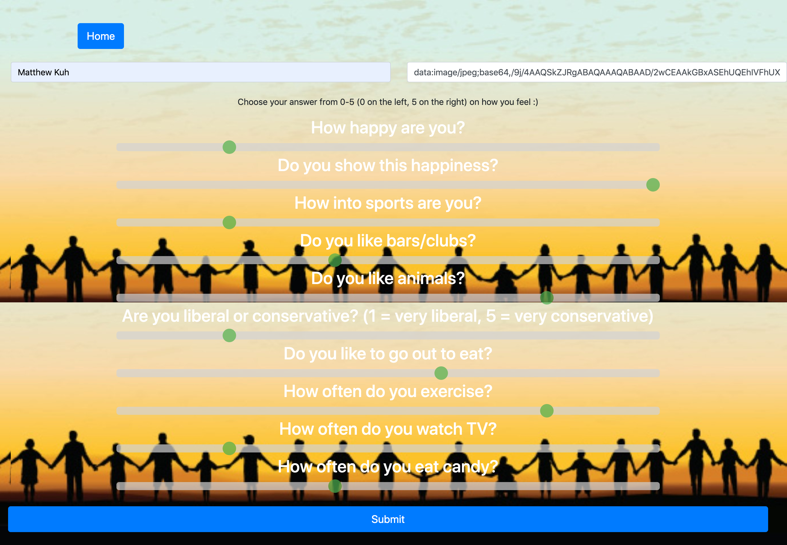

# Friend Finder

### I created a Friend Finder app that takes in an array of values from a set of 10 questions, and then compares those array of values by taking the absolute difference between each index in the arrays.  It then finds the person with the lowest difference, and matches you with them!  

## Tech I Used

1. [JavaScript](https://www.w3schools.com/js/js_intro.asp)
2. [Node](https://nodejs.org/en/about/)
3. [Express](https://expressjs.com/)

Author : [Matthew Kuh](https://github.com/matkuh)